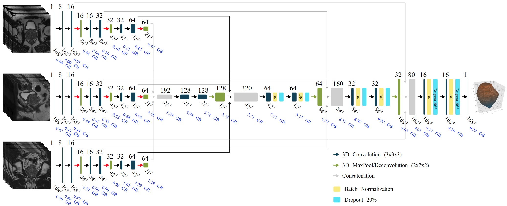

# Segmentation of prostate and prostate zones using Deep Learning: a multi-MRI vendor analysis

This repository contains a test case for one of our recent projects which consist of an automatic
segmentation algorithm for the prostate and its peripheral zone (PZ) using a 3D Convolutional Neural Network (CNN). 

The details of our algorithm will soon be published and we will add a link in here. 

With this program **six** different CNN models can be tested in **two** sample datasets. The two datasets contain MR images from 
different vendors: Siemens and GE. And the models are split in 3 for **prostate** segmentation and 3 for **PZ** segmentation. The
difference between the models is the training dataset used to build them, not the CNN architecture. 

## Overview

The architecture used to train our models is the following:


This project implements a multi-stream 3D U-Net that takes three orthogonal views (transversal, sagittal, coronal) as input and produces binary segmentation masks. The architecture is designed to leverage multi-planar information for improved segmentation accuracy.

## Features

- **Multi-stream 3D U-Net**: Processes three orthogonal views simultaneously
- **Automatic preprocessing**: Handles image resampling, normalization, and ROI extraction
- **Flexible inference**: Supports both evaluation (with ground truth) and inference (new cases)
- **Comprehensive visualization**: Generates visualization images and metrics
- **Multi-vendor support**: Tested on Siemens and GE MRI scanners

## Requirements

### Python Environment

This project uses `uv` for environment management. Create and activate the environment:

```bash
# Create environment in the project folder
uv venv .venv

# Activate environment
source .venv/bin/activate  # On Linux/Mac
# or
.venv\Scripts\activate  # On Windows

# Install dependencies
uv pip install -r requirements.txt
```

### Dependencies

- **TensorFlow** >= 2.15.0, < 3.0.0: Deep learning framework
- **SimpleITK** >= 2.3.0: Medical image processing
- **NumPy** >= 1.24.0, < 2.0.0: Numerical computing
- **Pandas** >= 2.0.0: Data manipulation
- **Matplotlib** >= 3.7.0, < 4.0.0: Visualization
- **SciPy** >= 1.10.0, < 2.0.0: Scientific computing
- **OpenCV** >= 4.8.0, < 5.0.0: Computer vision operations
- **scikit-image** >= 0.21.0: Image processing utilities
- **Pillow** >= 10.0.0: Image processing

## Data

The test data is freely available and can be downloaded from this link [data](https://goo.gl/193hqk). In order to edit the 
configuration file as little as possible, I suggest you to copy the data folder at the root folder of this repository.

## Project Structure

The organization of the folders is the one below, and its content is self explanatory. 

```
code/
├── config/
│   └── MainConfig.py          # Configuration settings
├── inout/
│   └── io_mri.py              # I/O functions for MRI images
├── models/
│   ├── models.py              # U-Net model definitions
│   └── metrics.py             # Evaluation metrics (Dice coefficient)
├── preproc/
│   └── utils.py               # Preprocessing utilities
├── visualization/
│   └── utilsviz.py            # Visualization functions
├── MakeSegmentation.py        # Script for evaluation (with ground truth)
└── OnlyInferenceSegmentation.py  # Script for inference (new cases)
```

## Usage

### 1. Evaluation Mode (with Ground Truth)

The file to run the test is inside the *code* folder and is `MakeSegmentation.py`. To configure the run you **must** edit
the file `MainConfig.py` inside *code/config*. The configuration file is well documented and there is not need to re-explain it
here. Just mention that in that file you can configure your input and output folders, which model to test, in which dataset, etc. 

To test any of the models, first edit the configuration file and then run it with:

```bash
cd code
python MakeSegmentation.py
```

Or using uv with the local environment:

```bash
uv run --python .venv/bin/python code/MakeSegmentation.py
```

This program will make a segmentation with the proposed CNN and it will create images showing the ground truth contour and the
predicted contour. It will also compute the Dice Coefficient of the segmentation and it will save it in a CSV file.

This script:
- Reads preprocessed ROI images
- Computes predictions
- Calculates Dice Similarity Coefficient (DSC) metrics
- Generates visualization images

### 2. Inference Mode (New Cases)

Use `OnlyInferenceSegmentation.py` to segment new cases without ground truth:

```bash
uv run --python .venv/bin/python code/OnlyInferenceSegmentation.py
```

Or if the environment is activated:

```bash
python code/OnlyInferenceSegmentation.py
```

Before running, configure the parameters in the `__main__` section:

```python
# Input folder: Where case folders are located
inputDirectory = join(root_folder, 'data', 'Test')

# Output folder: Where to save predictions
outputDirectory = join(root_folder, 'output', 'Test', 'Prostate')

# Model weights file
model_weights_file = join(root_folder, 'models', 'Prostate', 'Siemens.hdf5')

# Model configuration
model_name = '3dm'  # '3dm' or '3ddropout'
type_segmentation = 'Prostate'  # 'Prostate' or 'PZ'
```

## Example Results

Some of the images you should be able to generate with this test case are:

Prostate Segmentation | PZ Segmentation
:---------:|:---------:
 | 

## Input Data Format

Each case folder should contain:

### For Evaluation Mode:
- `img_tra.nrrd`: Original transversal image
- `hr_tra.nrrd`: High-resolution transversal image
- `ctr_pro.nrrd`: Prostate contour (ground truth)
- `roi_tra.nrrd`, `roi_sag.nrrd`, `roi_cor.nrrd`: Preprocessed ROI images
- `start_ROI.csv`, `size_ROI.csv`: ROI coordinates

### For Inference Mode:
- `img_tra.nrrd`: Transversal image
- `img_cor.nrrd`: Coronal image
- `img_sag.nrrd`: Sagittal image

## Output Files

The pipeline generates:

1. **Segmentation masks**:
   - `predicted_roi.nrrd`: ROI-level prediction (168×168×168)
   - `predicted_HR.nrrd`: High-resolution prediction (0.5mm isotropic)
   - `predicted_original_resolution.nrrd`: Original resolution prediction

2. **Visualization images**:
   - PNG images showing overlays of predictions on original images
   - Bar plots of Dice scores (evaluation mode only)

3. **Metrics** (evaluation mode only):
   - `all_DSC.csv`: Dice scores for all cases
   - `aroi_DSC.csv`: ROI-level Dice scores

## Model Architectures

### 3D Multi-Stream U-Net (`3dm`)

- Three parallel encoder branches (transversal, sagittal, coronal)
- Feature fusion in bottleneck layer
- Skip connections from each branch to decoder
- Output: Single binary segmentation mask

### 3D Multi-Stream U-Net with Dropout (`3ddropout`)

- Same architecture as `3dm` with dropout layers (rate=0.2)
- Reduces overfitting during training
- Recommended for smaller datasets

## Preprocessing Pipeline

1. **Intensity Normalization**: Percentile-based normalization (1st-99th percentile)
2. **Resampling**: To isotropic 0.5mm spacing
3. **ROI Extraction**: Automatic bounding box detection from intersection of three views
4. **Size Correction**: Padding/cropping to 168×168×168 voxels

## Performance

Typical Dice Similarity Coefficient (DSC) scores:
- **Prostate segmentation**: ~0.90-0.95
- **Peripheral Zone segmentation**: ~0.85-0.90

## Troubleshooting

### CUDA/GPU Warnings

If you see CUDA warnings but don't have a GPU, they can be safely ignored. The code will run on CPU.

### File Not Found Errors

Ensure:
- Case folders follow the naming convention: `Case-XXXX` (e.g., `Case-0001`)
- All required `.nrrd` files are present in each case folder
- File paths in configuration are correct

### Memory Issues

If you encounter out-of-memory errors:
- Process cases one at a time
- Reduce batch size if training
- Use CPU instead of GPU if GPU memory is limited

## Citation

If you use this code in your research, please cite the original paper.

## License

See LICENSE.md for details.

## Contact

For questions or issues, please open an issue on the repository.
